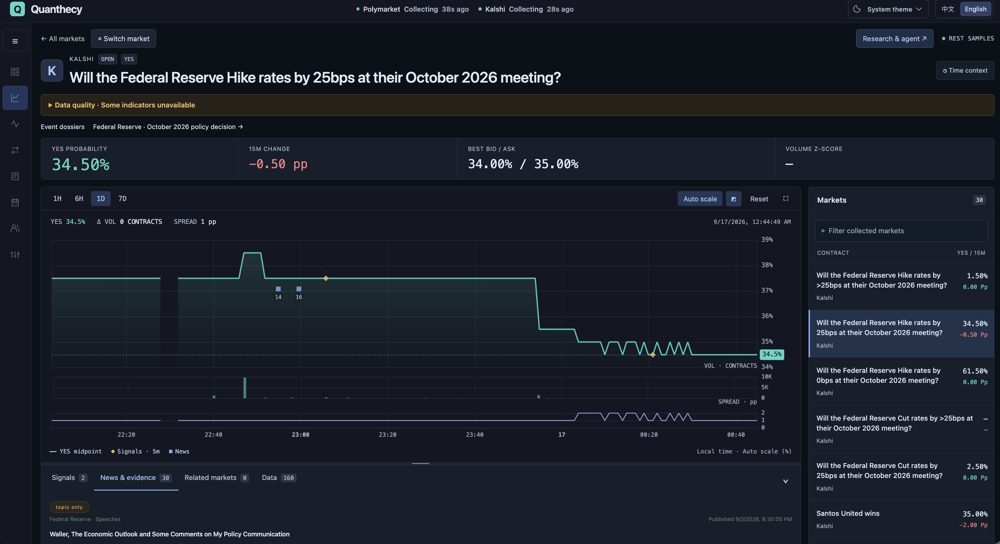
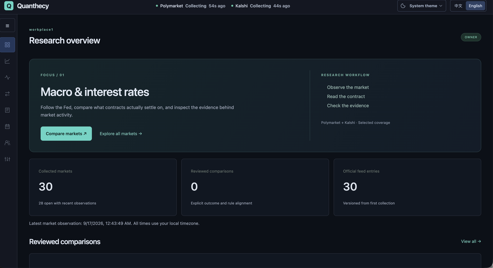
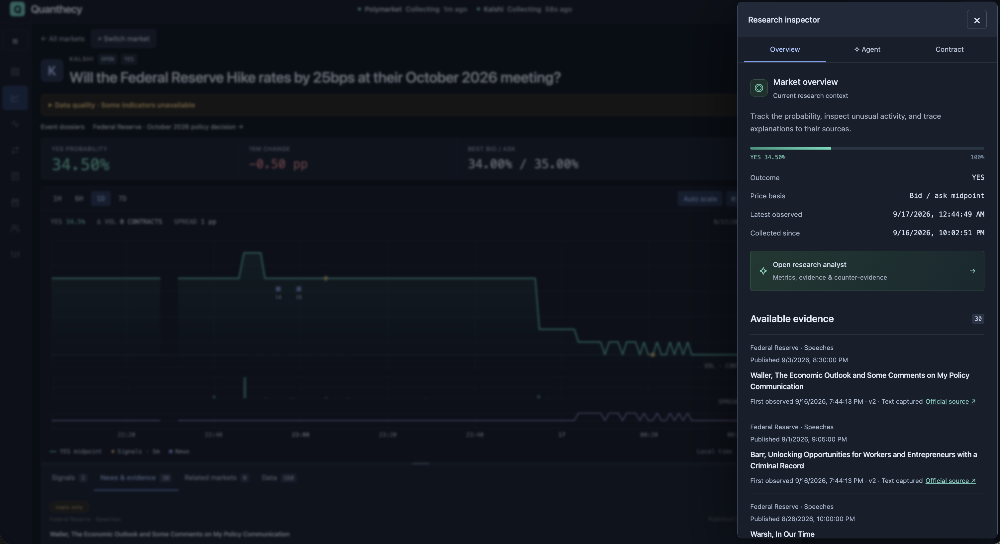
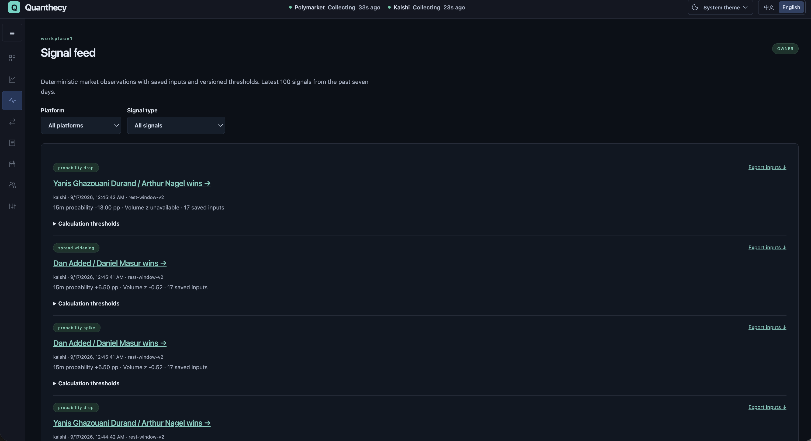
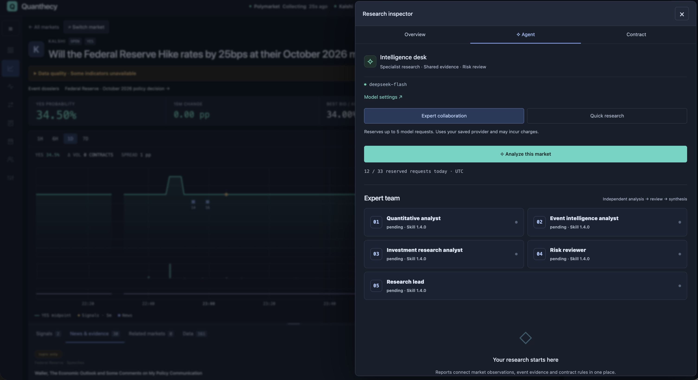
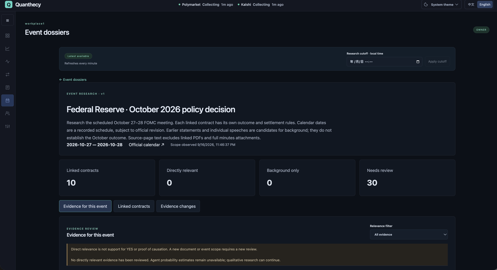
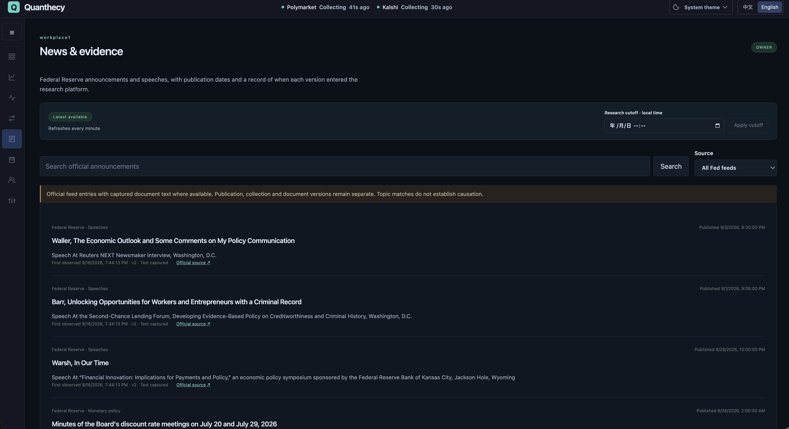
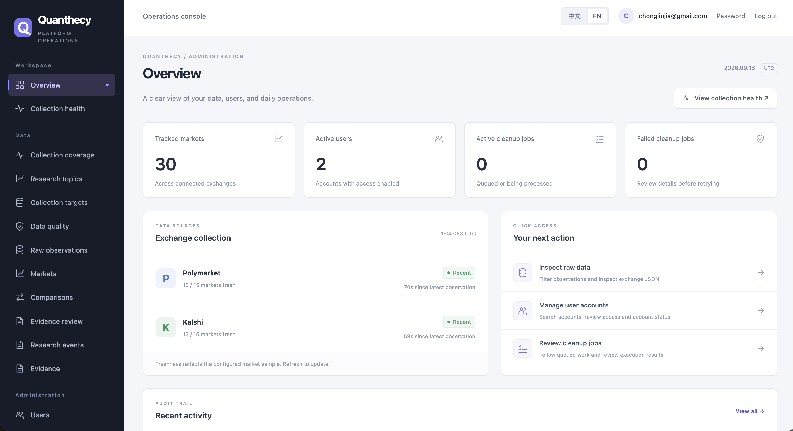

# Quanthecy

**English** · [简体中文](README.zh-CN.md)

**An open-source research terminal for prediction markets, with traceable evidence and AI analysis.**

Research **Polymarket** and **Kalshi** in one workspace. Follow market movements, check contract rules, inspect official evidence, and trace AI conclusions to the data available at the time.

[Quick start](#quick-start) · [Screenshots](#feature-tour) · [Documentation](#documentation) · [Roadmap](#current-scope-and-next-steps) · [Report a bug](https://github.com/chongliujia/Quanthecy/issues/new?template=bug_report.yml) · [Contribute](#contributing)

[Apache-2.0](LICENSE) · Self-hosted · English / 中文 · Light / dark themes



**Research MVP under active development.** These screenshots show a local installation with collected data. Coverage is selected, history begins at collection, and forecasts are not yet calibrated. Quanthecy does not execute trades or manage wallets.

## Quick start

Requires **Docker Engine and Docker Compose 2.24.4+**. The container workflow does not require host Python, Rust, Node.js, or database installations. Initial builds need access to image and package registries.

Clone or download this repository, then run from its root:

```bash
cp .env.example .env
docker compose up --build -d --wait
```

The `migrate` service applies Django and ClickHouse migrations before dependent services start. Named volumes preserve PostgreSQL, ClickHouse, Redis, and the collector's durable journal.

| Surface | Local address |
| --- | --- |
| Research workspace, registration, login | [localhost:3000](http://localhost:3000) |
| API documentation | [localhost:8000/api/v1/docs](http://localhost:8000/api/v1/docs) |
| Django operations console | [localhost:8000/admin/](http://localhost:8000/admin/) |
| Backend liveness / dependency readiness | [health](http://localhost:8000/health) / [ready](http://localhost:8000/ready) |

1. Register in the web app. Registration creates a personal workspace and its OWNER membership. **There is no default account or password.**
2. Open **Market explorer**. By default, the collector samples up to 10 markets per exchange every 60 seconds. Price/volume analytics need at least 15 minutes of sufficiently continuous, eligible observations.
3. Explore **News & evidence**. An independent worker polls six enabled official and media feeds every 15 minutes by default; two BLS feeds start paused after an HTTP 403 connectivity check. See [news sources](docs/news-sources.md) for coverage and controls. Example topics and event dossiers require operator initialization; they are not automatically populated on every fresh install.
4. For Agent research, follow the [model setup guide](docs/research-terminal.md) to configure credential encryption and a provider, then enable it in **Model settings** as a workspace owner. Models start disabled; explicitly initiated connection tests and research can incur provider charges.

<details>
<summary>Operator setup, collection coverage, ports, and development</summary>

Create a platform operator separately:

```bash
docker compose exec backend python apps/backend/manage.py createsuperuser
```

For managed market selection and the dated Fed example, follow [collection coverage](docs/collection-coverage.md) and [event evidence setup](docs/event-evidence.md). For reviewed market pairs, use the [comparison setup](docs/cross-market-evidence.md#initial-pair-setup). Recheck dated manifests and expired contracts before reuse.

`WEB_PORT` and `BACKEND_PORT` in `.env` control local host ports. Leaving `DJANGO_CSRF_TRUSTED_ORIGINS` empty follows `WEB_PORT`; custom origins can be set explicitly. Recreate affected services after changing configuration. See the [optional proxy setup](docs/market-research.md#optional-local-proxy) when needed.

For hot reload, run `make dev` (its local setup helper requires host Python 3). Rebuild images after dependency or Rust changes. Stop services while retaining named volumes with:

```bash
docker compose down
```

</details>

## What makes the research useful

- **Data quality before interpretation.** Price and volume indicators have separate eligibility checks. Missing history, stale quotes, incompatible rules, and unreliable measurement bases remain visible.
- **Contract-aware comparisons.** Related questions can settle differently. Cross-platform research uses reviewed outcome and settlement alignment rather than treating every price difference as arbitrage.
- **Evidence you can inspect.** Event dossiers connect a versioned research question to contracts, official documents, original paragraphs, and append-only relevance reviews.
- **Traceable Agent work.** Models interpret deterministic metrics within frozen context. Reports retain citations, expert stages, model/configuration versions, usage, limitations, and validation diagnostics.

## Feature tour

Expand a workflow to see its desktop screenshot and details. This page uses English images; the [Chinese README](README.zh-CN.md) uses Chinese images. All 16 original captures and their dates are in the [screenshot index](docs/images/README.md).

<details>
<summary>Research overview</summary>

Start with collection status, research coverage, reviewed-comparison counts, and official feed entries. The overview connects the macroeconomics and interest-rate research topic to market exploration, contract comparison, and evidence inspection.



</details>

<details>
<summary>Market research terminal</summary>

The terminal shown at the top of this page combines YES probability history, bid/ask quotes, spread and sampled-volume charts, and a market-switching panel. Inspect signals and news on the same timeline, change the historical window, review contract rules, and export collected history as CSV or Parquet. The UI supports English/Chinese and light/dark/system themes.

The screenshot also shows a partial data-quality warning and an unavailable volume Z-score. An available price series does not make every other indicator valid.

</details>

<details>
<summary>Research inspector and source evidence</summary>

Open the inspector alongside the market chart to check the outcome, probability basis, latest observation, and collection start time. Its evidence list links to saved source records and official publications; separate tabs expose the Agent workspace and contract details.



</details>

<details>
<summary>Reproducible signal feed</summary>

Filter deterministic observations by platform and signal type. Each entry exposes the calculation version, probability change, available volume metrics, saved input count, thresholds, and an input export for reproduction.



</details>

<details>
<summary>On-demand specialist research</summary>

Five versioned roles work through a shared research workflow: **quantitative analyst → event intelligence analyst → investment research analyst → risk reviewer → research lead**. The first three receive independent scoped inputs, the reviewer challenges their conclusions, and the lead synthesizes a structured report. Quick single-Agent research is also available.



This screenshot shows the team **before execution**, not a completed report. A team run reserves up to five model requests and uses the workspace's configured provider. Page loads and saving settings do not invoke a model. Citation, schema, and forecast checks guard publication; they do not prove a claim is true.

</details>

<details>
<summary>Event dossiers and official evidence</summary>

Beyond the inspector, event dossiers organize scope, linked contracts, evidence, and changes. Documents retain publication and observation times and saved versions. Operators review the relevance of an exact document version to an exact event definition; new versions require a new review. See the [event evidence guide](docs/event-evidence.md).



The example shows 10 linked contracts and 30 evidence entries awaiting review, with no reviewed directly relevant evidence. A source match alone does not establish direct relevance, causation, or support for an outcome. Without the required reviewed evidence and market-quality checks, the Agent must abstain from a probability estimate; qualitative research can continue.

</details>

<details>
<summary>News and evidence</summary>

Search official economic announcements and selected business news, filter by source or official/media type, and apply a research cutoff to inspect the saved versions available at that time. Each entry distinguishes publication time from first observation, shows its revision and text-capture status, and links to the original source. Full-page text capture is available for the supported Fed release and speech adapters; other sources show feed-only coverage. Inspect current source health and pause/resume collection in Admin. The screenshot below predates the expanded source registry. See the [official evidence guide](docs/official-evidence.md).



</details>

<details>
<summary>Data quality and platform administration</summary>

The bilingual Django operations console shows per-market eligibility, collector freshness, coverage, and reasons for unavailable indicators. Operators can distinguish a usable price window from a usable volume baseline instead of interpreting missing metrics as zero.

Its overview brings together tracked markets, active accounts, cleanup-job counts, and exchange collection status. Navigation and shortcuts lead to raw observations, user management, evidence reviews, and cleanup jobs.



Inspect the original exchange JSON alongside its normalized record. Authorized operators can preview and queue raw-payload cleanup, follow background jobs, and inspect audit records. Cleanup preserves normalized analytical history. The console also manages research topics, collection targets, evidence reviews, user status, and operator permissions.

See the [data-quality policy](docs/data-quality.md) and [platform administration guide](docs/platform-administration.md) for these operator workflows.

</details>

## Architecture

```text
Polymarket / Kalshi
        │
        ▼
Rust + Tokio collector ──────► ClickHouse: historical observations
        │                              │
        └────► Redis: live state       ▼
                              Python: deterministic metrics + signals
                                       │
Official + media feeds                 ▼
        │                     Frozen research context
        ▼                              │
Python news worker                     ▼
        │                     Agent worker: specialist research
        ▼                              │
PostgreSQL: evidence ◄─────────────────┘ research runs
        ▲
        │
Django + Django Ninja ── analytical repository ── ClickHouse
        ▲
        │ one application API
React + TypeScript + Vite
```

| Layer | Responsibility |
| --- | --- |
| Rust / Tokio | Exchange ingestion, normalization, batching, durable replay, recovery |
| Django / Django Ninja | Authentication, organizations, authorization, typed APIs, administration |
| Python workers | Deterministic analytics, signals, official evidence, Agent jobs, maintenance |
| PostgreSQL | Transactional application data, market metadata, evidence, research execution metadata |
| ClickHouse | Historical analytical observations and reproducible signal data |
| Redis | Ephemeral live state, cache, and coordination |
| React / TypeScript / Vite | Customer research workspace, charts, language and theme preferences |

Django is the canonical public backend; its ORM owns PostgreSQL schema migrations. ClickHouse uses a dedicated analytical repository. Long-running work stays in independent workers, and the frontend accesses data through Django APIs.

**Identity:** `User = identity`, `Organization = workspace`, `Membership = authorization`. Users and organizations use UUIDs; email uniqueness is case-insensitive. OWNER, ADMIN, MEMBER, and VIEWER are organization roles. Platform staff permissions are separate, and tenant isolation is enforced on the server. External identity linkage has a model boundary; provider login is not yet implemented.

**Data semantics:** normalized observations retain platform/exchange IDs, market and outcome identity, rules version, received time, explicit probability basis/source, bid/ask, volume unit/basis, and quality flags. Raw exchange JSON is stored separately. Midpoint, last trade, and executable prices are not interchangeable.

**Signals:** the current deterministic framework detects `PROBABILITY_SPIKE`, `PROBABILITY_DROP`, `VOLUME_SPIKE`, and `SPREAD_WIDENING`. Each signal records its version, parameters, and source observation IDs for replay. LLMs interpret these calculations; they are not the numerical engine.

### Example structured research output

Illustrative quick-research JSON; reference IDs are placeholders, not an actual published result. `confidence` concerns research priority, not event probability.

```json
{
  "action": "WATCH",
  "confidence": 0.6,
  "thesis": {
    "kind": "HYPOTHESIS",
    "text": "Monitor this contract while the relevant evidence is reviewed.",
    "references": ["evidence:example"]
  },
  "claims": [],
  "counter_evidence": [],
  "key_signals": [],
  "risk_flags": ["Direct event relevance has not yet been established."],
  "follow_up": ["Review the source version and contract settlement rules."]
}
```

## Current scope and next steps

| Available now | Planned / not yet implemented |
| --- | --- |
| Selected Polymarket/Kalshi REST snapshots and collected history | Broad exchange coverage, streaming trades and order books |
| Quality-gated metrics, signals, reviewed comparisons, exports | Richer features, lead/lag studies and historical backtesting |
| Official document versions, event dossiers, paragraph-level relevance reviews | Broader source coverage, linked PDF ingestion, inferred knowledge-graph relationships |
| On-demand specialist and quick research, frozen inputs, validation diagnostics | Outcome reconciliation, forecast calibration, signal-triggered research and scheduled digests |
| Workspaces, memberships, bilingual administration | Watchlists/alerts, billing, subscriptions, invitations and external login |

Collected snapshots do not provide a complete tick history or executable liquidity. Cross-platform coverage is curated. Forecasts are conditional and uncalibrated; no measured accuracy or profitability is claimed. The initial focus is research, with macroeconomics and interest rates as the first curated topic.

## Production deployment

A single-server Docker Compose configuration is provided in [compose.prod.yaml](compose.prod.yaml). Follow the [production configuration guide](docs/foundation.md#production-configuration) to set the domain and independent secrets, configure HTTPS, and keep databases internal. Backups/restores, monitoring, authentication rate limits, and account recovery need operational work before a public launch.

## Documentation

| Guide | Contents |
| --- | --- |
| [Research terminal](docs/research-terminal.md) | Chart interactions, model connections, quotas and jobs |
| [Specialist intelligence team](docs/intelligence-team.md) | Roles, scoped context, reports and validation |
| [Data quality](docs/data-quality.md) | Eligibility checks and measurement limits |
| [Collection coverage](docs/collection-coverage.md) | Topics, selected contracts and collector acknowledgement |
| [Event dossiers](docs/event-evidence.md) | Event definitions, exact source versions and relevance review |
| [News sources](docs/news-sources.md) | Feed registry, source controls, provenance and collection health |
| [Official documents](docs/official-evidence.md) | Source capture, paragraph provenance and limits |
| [Market research](docs/market-research.md) | History, signals, exports and reproducibility |
| [Comparisons and evidence](docs/cross-market-evidence.md) | Rule alignment, official feeds and historical cutoffs |
| [Platform administration](docs/platform-administration.md) | Operators, users, raw data, cleanup and audit |
| [Foundation](docs/foundation.md) | Identity, APIs, development and deployment |
| [Product scope](docs/product-scope.md), [roadmap](docs/roadmap.md), [automated research](docs/automated-research.md) | Product direction and future work |
| [AGENTS.md](AGENTS.md) | Architecture and contributor requirements |

## Contributing

Start with the [contribution guide](CONTRIBUTING.md), [report a bug](https://github.com/chongliujia/Quanthecy/issues/new?template=bug_report.yml), or [suggest a feature](https://github.com/chongliujia/Quanthecy/issues/new?template=feature_request.yml). English and Chinese reports are welcome.

Contributions to collection reliability, data quality, evidence review, evaluation, accessibility, and documentation are welcome. Read [AGENTS.md](AGENTS.md), keep changes focused, document changed behavior, and include relevant tests. Never commit credentials, local databases, or private account screenshots.

The container checks are:

```bash
make test-python
make check-python
make test-rust
make test-web
make check-contracts
```

Python integration tests use PostgreSQL. Normal tests mock exchange/model calls; optional ClickHouse integration checks are described in the research guides. The [foundation guide](docs/foundation.md) also documents host development workflows.

## License

Project code is licensed under the [Apache License 2.0](LICENSE). Exchange data, official documents, and other third-party content retain their respective terms; the code license does not relicense those sources.
