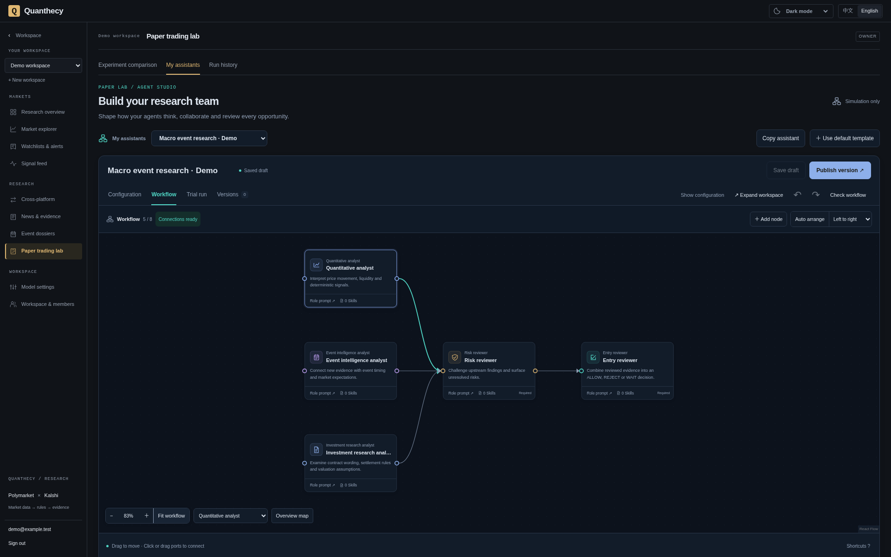
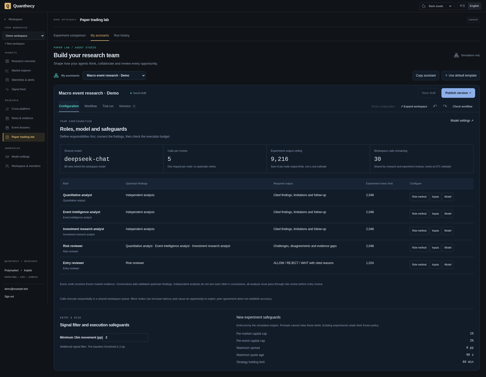
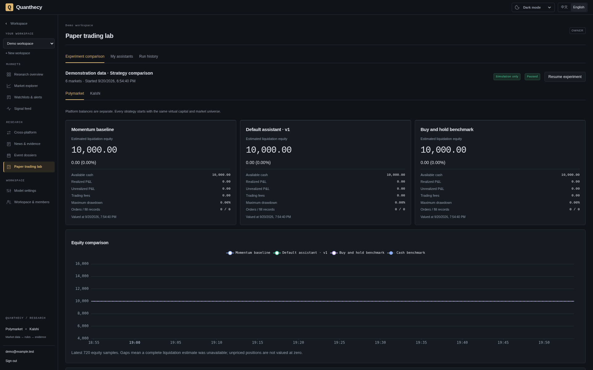
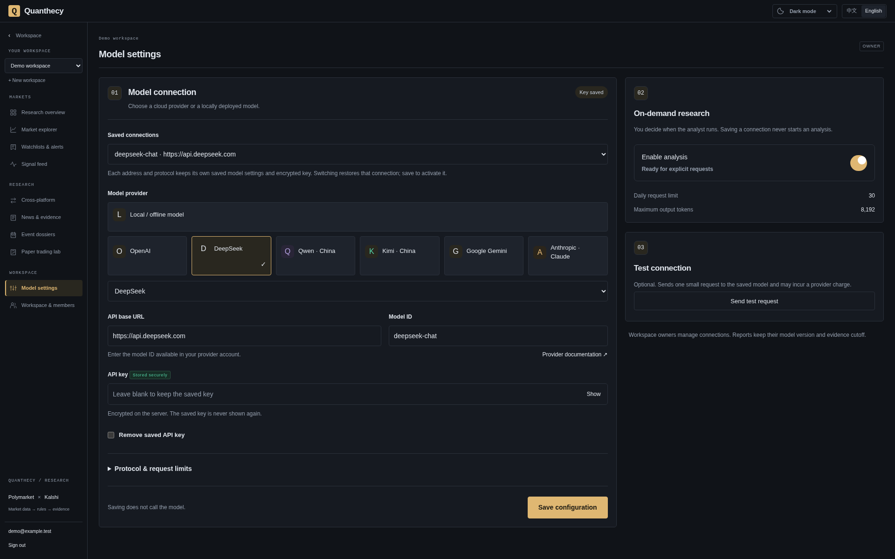

# Quanthecy

**English** · [简体中文](README.zh-CN.md)

**Prediction-market research, multi-agent workflows, and a paper trading lab.**

Research **Polymarket** and **Kalshi** in one workspace. Start with market data and traceable evidence, configure a research team, publish its workflow, and compare how virtual accounts analyze, abstain, and participate in simulated trading.

[Quick start](#quick-start) · [Feature tour](#feature-tour) · [Architecture](#architecture) · [Documentation](#documentation) · [Contribute](#contributing)

[Apache-2.0](LICENSE) · Self-hosted · English / 中文 · Dark / light / system themes



*Current interface, demonstration workspace. Captured on 2026-09-20 with isolated demo data; this is not a completed model run or evidence of strategy performance.*

**Research platform under active development.** Paper experiments use virtual capital; Quanthecy does not connect wallets or send real trading orders. Coverage is selected and history begins at collection. Forecast accuracy and strategy profitability have not been established.

## Feature tour

### Configure a research team you can inspect

Build workflows with quantitative, event intelligence, contract analysis, risk review, and entry review roles. Edit each node’s Prompt and Markdown Skills, connect its dependencies, validate the graph, and save a draft, run a trial, or publish an immutable version.

- **Understand responsibilities:** the configuration overview lists roles, direct upstream nodes, output requirements, and research checklists you can append to prompts.
- **Understand budgets:** inspect calls per run, remaining workspace allowance, and node output limits. Nodes can have individual token caps; they currently share the workspace model.
- **Inspect the evidence:** each node receives frozen market context and only its explicitly connected upstream conclusions. Runs retain inputs, validated outputs, model configuration, and usage.
- **Edit comfortably:** drag, zoom, expand, auto-arrange, undo, and redo. Nodes can move left of the origin to use the available canvas space.

<details>
<summary>Team configuration and risk controls</summary>



Analysis branches have independent inputs; model requests currently run sequentially through the workspace queue. The entry threshold is adjustable within bounds. Capital limits, quote freshness, and other fixed rules are enforced by the server and cannot be relaxed by a prompt. Existing experiments retain their frozen rules.

See the [assistant builder](docs/assistant-builder.md) and [model, role, and risk configuration](docs/agent-configuration.md).

</details>

### Compare assistants and baselines in one experiment

The paper lab creates independent virtual accounts for each platform and strategy. A new comparison can include the default assistant, up to three selected published versions, momentum and buy-and-hold accounts, plus a cash benchmark.



*Demo accounts start with 10,000 virtual capital each and have no fills, so their curves overlap. This capture illustrates the interface, not strategy performance.*

Inspect equity, fees, drawdown, fills, review participation, queue delay, and model usage together. Dedicated entry reviews return `ALLOW / REJECT / WAIT`; an allowed entry still faces fresh signal, price, contract, capital, and order-book checks. Pausing retains positions and history while valuation and verified settlement continue.

Simulated fills use later order-book snapshots with fee, depth, and slippage constraints. Shared queues, rejection, expiry, and different samples affect comparisons. Model costs remain unknown without billing data. See [execution rules](docs/paper-trading-v2.md) and [multi-assistant experiments](docs/assistant-builder.md#模拟交易与评估).

### Keep cloud and local model connections ready

Save connection profiles and restore their model IDs, output limits, and related options. Profiles are isolated by workspace, protocol, and full API base URL. Switching back can reuse that connection’s saved credential.

<details>
<summary>Saved model connections</summary>



Credentials are encrypted on the server; the frontend receives only their saved status. A new endpoint never inherits another connection’s key. Browsing, saving settings, and publishing assistants make no model calls. Explicit tests, trials, and automatic reviews in an enabled experiment can incur provider charges.

This is a demonstration configuration; no provider request was executed. See the [model setup guide](docs/research-terminal.md#one-time-server-setup) for deployment and local endpoint requirements.

</details>

### Trace market observations through to a research conclusion

| Capability | What you can inspect |
| --- | --- |
| Market terminal | Probability history, bid/ask, spreads, sampled volume, contract rules, CSV / Parquet exports |
| Data quality and signals | Separate price/volume eligibility, calculation versions, thresholds, and source observations |
| News and event evidence | Document versions, publication and first-observed times, source paragraphs, relevance reviews |
| Cross-platform comparisons | Reviewed outcome alignment and settlement differences, before interpreting a price gap |
| Watchlists and alerts | Shared workspace lists, midpoint-change and spread-widening alerts with retained trigger inputs |
| Research reports | Single-Agent or specialist conclusions, citations, limitations, and validation diagnostics |

<details>
<summary>Market terminal and earlier captures with collected data</summary>


This 2026-09-17 capture uses collected market data and predates the current interface. Original bilingual overview, signal, event, news, and administration captures remain in the [screenshot index](docs/images/README.md), with provenance separate from the new demo set.

</details>

## Quick start

Requires **Docker Engine and Docker Compose 2.24.4+**. The container workflow does not require host Python, Rust, Node.js, or database installations. Initial builds need access to image and package registries.

Clone or download this repository, then run from its root:

```bash
cp -n .env.example .env
docker compose up --build -d --wait
```

The `migrate` service applies Django and ClickHouse migrations before dependent services start. Named volumes preserve PostgreSQL, ClickHouse, Redis, and the collector's durable journal.

| Surface | Local address |
| --- | --- |
| Research workspace, registration, login | [localhost:3000](http://localhost:3000) |
| API documentation | [localhost:8000/api/v1/docs](http://localhost:8000/api/v1/docs) |
| Django operations console | [localhost:8000/admin/](http://localhost:8000/admin/) |
| Backend liveness / dependency readiness | [health](http://localhost:8000/health) / [ready](http://localhost:8000/ready) |

1. Register in the web app. Registration creates a personal workspace and its OWNER membership. **There is no default account or password.**
2. Open **Market explorer**. By default, the collector samples up to 10 markets per exchange every 60 seconds. Price/volume analytics need at least 15 minutes of sufficiently continuous, eligible observations.
3. For model analysis, follow [server model setup](docs/research-terminal.md#one-time-server-setup) to configure a stable `AGENT_ENCRYPTION_KEY` and allowed provider endpoints. A workspace owner can then save and enable a connection in **Model settings**. Local `make setup-local` initializes a missing encryption key and requires host Python 3; the same guide includes a Docker-only option. Models start disabled.
4. Open **Paper trading lab → My assistants**, copy the default template, edit roles and dependencies, inspect the configuration, run a trial, and publish a version. Trials call the model but create no simulated orders.
5. In **Experiment comparison**, select published versions and markets to start a virtual-capital experiment. Eligible opportunities then automatically queue model reviews and consume workspace allowance.

A fresh installation needs time to collect data. See [news sources](docs/news-sources.md) and [collection coverage](docs/collection-coverage.md) for feed, topic, and example-dossier setup. README demo accounts are not imported into new installations.

<details>
<summary>Operator setup, collection coverage, ports, and development</summary>

Create a platform operator separately:

```bash
docker compose exec backend python apps/backend/manage.py createsuperuser
```

For managed market selection and the dated Fed example, follow [collection coverage](docs/collection-coverage.md) and [event evidence setup](docs/event-evidence.md). For reviewed market pairs, use the [comparison setup](docs/cross-market-evidence.md#initial-pair-setup). Recheck dated manifests and expired contracts before reuse.

`WEB_PORT` and `BACKEND_PORT` in `.env` control local host ports. Leaving `DJANGO_CSRF_TRUSTED_ORIGINS` empty follows `WEB_PORT`; custom origins can be set explicitly. Recreate affected services after changing configuration. See the [optional proxy setup](docs/market-research.md#optional-local-proxy) when needed.

For hot reload, run `make dev` (its local setup helper requires host Python 3). Rebuild images after dependency or Rust changes. Stop services while retaining named volumes with:

```bash
docker compose down
```

</details>

## Architecture

```text
Polymarket / Kalshi
        │
        ▼
Rust + Tokio collector ──────► ClickHouse: historical observations
        │                              │
        └────► Redis: live state       ▼
                              Python: deterministic metrics + signals
                                       │
Official + media feeds                 ▼
        │                     Frozen research context
        ▼                              │
Python news worker                     ▼
        │                     Agent worker: specialist research
        ▼                              │
PostgreSQL: evidence ◄─────────────────┘ research runs
        ▲
        │
Django + Django Ninja ── analytical repository ── ClickHouse
        ▲
        │ one application API
React + TypeScript + Vite
```

| Layer | Responsibility |
| --- | --- |
| Rust / Tokio | Exchange ingestion, normalization, batching, durable replay, recovery |
| Django / Django Ninja | Authentication, organizations, authorization, typed APIs, administration |
| Python workers | Deterministic analytics, signals, official evidence, LangGraph Agent workflows, paper simulation, maintenance |
| PostgreSQL | Transactional application data, market metadata, evidence, assistant versions, runs, and virtual ledgers |
| ClickHouse | Historical analytical observations and reproducible signal data |
| Redis | Ephemeral live state, cache, and coordination |
| React / TypeScript / Vite | Customer research workspace, charts, language and theme preferences |

Django is the canonical public backend; its ORM owns PostgreSQL schema migrations. ClickHouse uses a dedicated analytical repository. Long-running work stays in independent workers, and the frontend accesses data through Django APIs.

In the paper lab, a qualified signal starts a frozen workflow review. An `ALLOW` result returns to deterministic execution checks, then later order-book snapshots determine simulated fills. Django retains the workflow version, review, order, and virtual ledger for inspection.

**Identity:** `User = identity`, `Organization = workspace`, `Membership = authorization`. Users and organizations use UUIDs; email uniqueness is case-insensitive. OWNER, ADMIN, MEMBER, and VIEWER are organization roles. Platform staff permissions are separate, and tenant isolation is enforced on the server. External identity linkage has a model boundary; provider login is not yet implemented.

**Data semantics:** normalized observations retain platform/exchange IDs, market and outcome identity, rules version, received time, explicit probability basis/source, bid/ask, volume unit/basis, and quality flags. Raw exchange JSON is stored separately. Midpoint, last trade, and executable prices are not interchangeable.

**Signals:** the current deterministic framework detects `PROBABILITY_SPIKE`, `PROBABILITY_DROP`, `VOLUME_SPIKE`, and `SPREAD_WIDENING`. Each signal records its version, parameters, and source observation IDs for replay. LLMs interpret these calculations; they are not the numerical engine.

### Example structured research output

Illustrative quick-research JSON; reference IDs are placeholders, not an actual published result. `confidence` concerns research priority, not event probability.

```json
{
  "action": "WATCH",
  "confidence": 0.6,
  "thesis": {
    "kind": "HYPOTHESIS",
    "text": "Monitor this contract while the relevant evidence is reviewed.",
    "references": ["evidence:example"]
  },
  "claims": [],
  "counter_evidence": [],
  "key_signals": [],
  "risk_flags": ["Direct event relevance has not yet been established."],
  "follow_up": ["Review the source version and contract settlement rules."]
}
```

## Current scope and next steps

| Available now | Planned / not yet implemented |
| --- | --- |
| Workflow canvas, Prompt / Skills, frozen releases, per-node run records | Version diffs and more research-team templates |
| Saved cloud/local connections, node token caps, workspace allowance | Per-node model selection and versioned configurable risk policies |
| Prospective paper experiments, multiple assistants, baselines, replayable fills | Paired evaluation on common inputs, role contribution analysis, forecast calibration |
| Selected REST collection, quality checks, replayable signals, history exports | Broader coverage, streaming trades/order books, full historical backtesting |
| Source evidence, event dossiers, reviewed comparisons, watchlists and in-app alerts | More sources, external alerts, invitations, external login, subscriptions and billing |

Collected snapshots do not provide complete tick history or guaranteed executable liquidity. Macroeconomics and interest rates are the first curated research topic. See the [Agent configuration roadmap](docs/agent-configuration.md) for the next design steps.

## Production deployment

A single-server Docker Compose configuration is provided in [compose.prod.yaml](compose.prod.yaml). Follow the [production configuration guide](docs/foundation.md#production-configuration) to set the domain and independent secrets, configure HTTPS, and keep databases internal. Backups/restores, monitoring, authentication rate limits, and account recovery need operational work before a public launch.

## Documentation

| Guide | Contents |
| --- | --- |
| [Research terminal](docs/research-terminal.md) | Chart interactions, model connections, quotas and jobs |
| [Specialist intelligence team](docs/intelligence-team.md) | Roles, scoped context, reports and validation |
| [Watchlists and alerts](docs/watchlists-alerts.md) | Workspace lists, rule windows, trigger provenance and worker recovery |
| [Paper trading lab](docs/paper-trading-v2.md) | Virtual accounts, automatic entry reviews, versioned comparisons and replayable fills |
| [Assistant builder](docs/assistant-builder.md) | LangGraph workflows, visual editing, immutable releases, trials and paper comparisons |
| [Data quality](docs/data-quality.md) | Eligibility checks and measurement limits |
| [Market discovery](docs/market-directory.md) | Paginated directory, bulk selection, collection tiers and settlement checks |
| [Collection controls](docs/collection-controls.md) | Admin switches, per-source frequency, acknowledgement and recovery |
| [Collection coverage](docs/collection-coverage.md) | Topics, selected contracts and collector acknowledgement |
| [Event dossiers](docs/event-evidence.md) | Event definitions, exact source versions and relevance review |
| [News sources](docs/news-sources.md) | Feed registry, source controls, provenance and collection health |
| [Official documents](docs/official-evidence.md) | Source capture, paragraph provenance and limits |
| [Market research](docs/market-research.md) | History, signals, exports and reproducibility |
| [Comparisons and evidence](docs/cross-market-evidence.md) | Rule alignment, official feeds and historical cutoffs |
| [Platform administration](docs/platform-administration.md) | Operators, users, raw data, cleanup and audit |
| [Foundation](docs/foundation.md) | Identity, APIs, development and deployment |
| [Product scope](docs/product-scope.md), [roadmap](docs/roadmap.md), [automated research](docs/automated-research.md) | Product direction and future work |
| [AGENTS.md](AGENTS.md) | Architecture and contributor requirements |

Core development guides: [Agent configuration and boundaries](docs/agent-configuration.md) · [Terminal visual design](docs/frontend-terminal.md) · [Isolated tests and CI](docs/testing.md) · [Screenshot provenance](docs/images/README.md).

## Contributing

Contributions to collection reliability, data quality, research evaluation, assistant usability, and documentation are welcome. Start with [AGENTS.md](AGENTS.md) and the [contribution guide](CONTRIBUTING.md), [report a bug](https://github.com/chongliujia/Quanthecy/issues/new?template=bug_report.yml), or [suggest a feature](https://github.com/chongliujia/Quanthecy/issues/new?template=feature_request.yml). English and Chinese reports are welcome.

```bash
make check       # Isolated stack: Python, Rust, frontend, and contract checks
make test-down   # Remove the test stack
```

Tests use separate PostgreSQL, ClickHouse, and Redis services with mocked exchange and model responses; provider keys are unnecessary. Individual targets include `make test-python`, `make check-python`, `make test-rust`, `make test-web`, and `make check-contracts`. See [testing and CI](docs/testing.md). Never commit credentials, local databases, or private account screenshots.

## License

Project code is licensed under the [Apache License 2.0](LICENSE). Exchange data, official documents, and other third-party content retain their respective terms; the code license does not relicense those sources.
