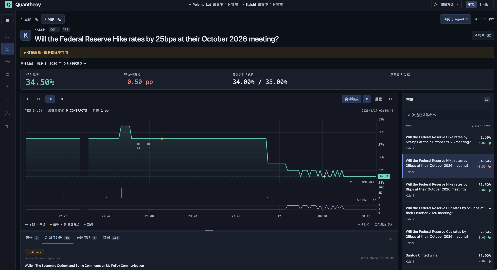
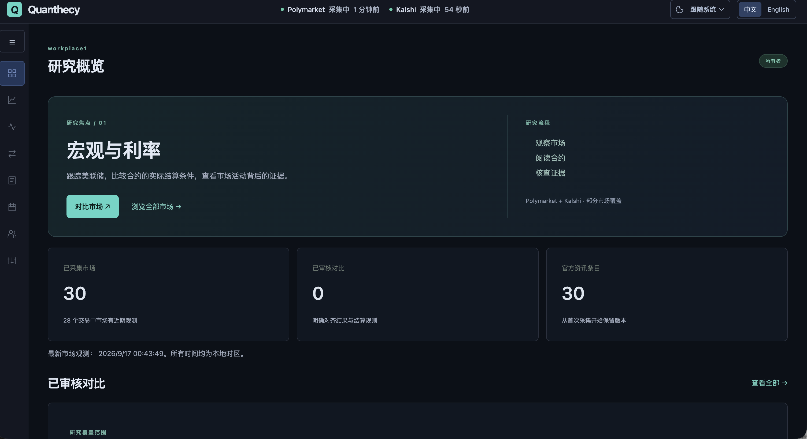
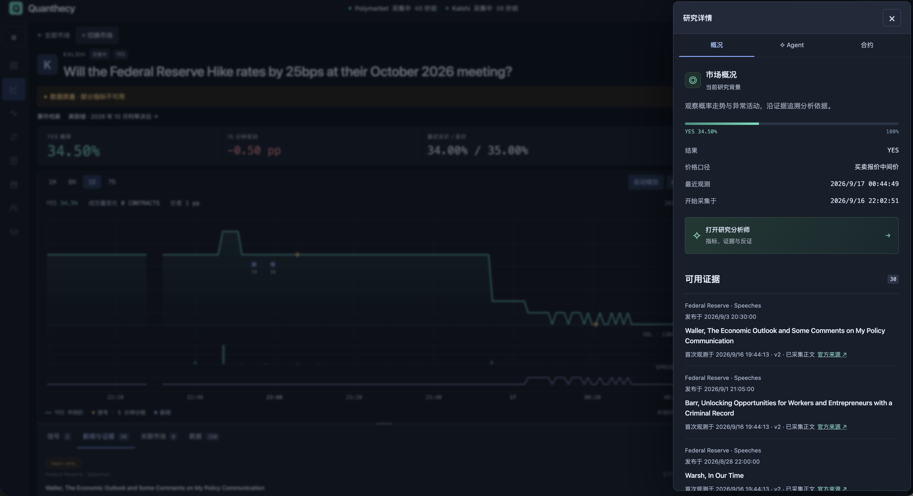
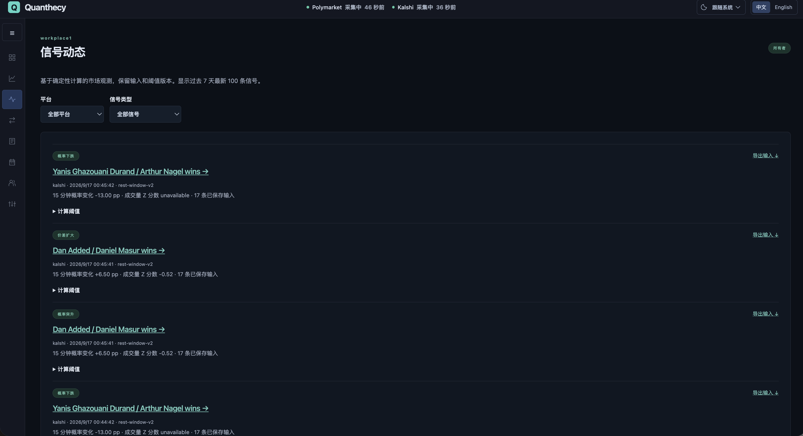
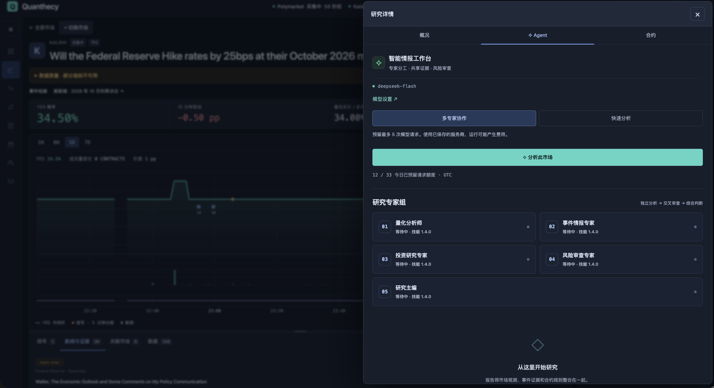
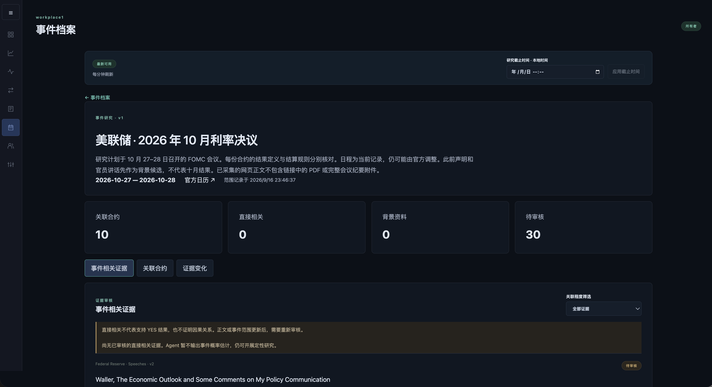
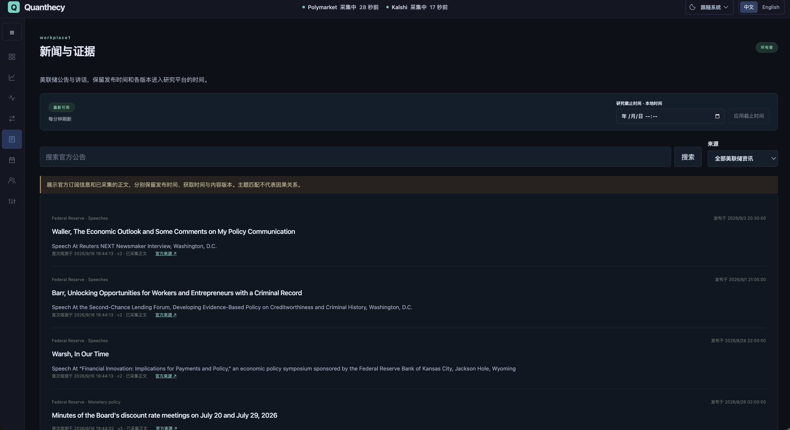
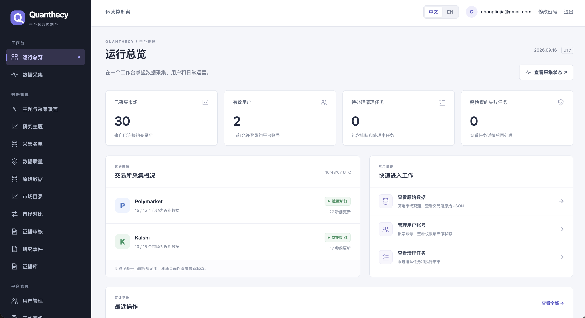

# Quanthecy

[English](README.md) · **简体中文**

**开源预测市场研究终端：连接市场变化、可追溯证据与 AI 分析。**

在同一工作区研究 **Polymarket** 和 **Kalshi**。跟踪市场变化、核对合约规则、检查官方证据，并追溯 AI 结论及形成结论时实际可用的数据。

[快速开始](#快速开始) · [界面预览](#功能导览) · [文档](#文档) · [路线图](#当前范围与后续方向) · [反馈问题](https://github.com/chongliujia/Quanthecy/issues/new?template=bug_report.yml) · [参与贡献](#参与贡献)

[Apache-2.0](LICENSE) · 自行部署 · 中英文切换 · 日间 / 夜间主题



**持续开发中的研究 MVP。** 截图来自本地平台，展示实际采集的数据。当前覆盖范围经过筛选，历史从开始采集时积累，预测尚未完成校准。平台不执行交易，也不管理钱包。

## 快速开始

需要 **Docker Engine 与 Docker Compose 2.24.4 或更新版本**。容器启动方式不要求在宿主机安装 Python、Rust、Node.js 或数据库。首次构建需要访问镜像和软件包仓库。

克隆或下载仓库后，在项目根目录执行：

```bash
cp .env.example .env
docker compose up --build -d --wait
```

`migrate` 服务会先应用 Django 和 ClickHouse 迁移，再启动依赖服务。PostgreSQL、ClickHouse、Redis 及采集器持久化日志使用命名卷保存。

| 入口 | 本地地址 |
| --- | --- |
| 研究工作台、注册与登录 | [localhost:3000](http://localhost:3000) |
| API 文档 | [localhost:8000/api/v1/docs](http://localhost:8000/api/v1/docs) |
| Django 运营后台 | [localhost:8000/admin/](http://localhost:8000/admin/) |
| 后端存活 / 依赖就绪检查 | [health](http://localhost:8000/health) / [ready](http://localhost:8000/ready) |

1. 在前端注册账号，系统会创建个人工作区及 OWNER 成员关系。**项目没有默认账号或密码。**
2. 打开「市场浏览」。默认每 60 秒从每个交易所采样最多 10 个市场；价格与成交量分析需要至少 15 分钟足够连续且合格的观测。
3. 查看「新闻与证据」。独立新闻工作进程默认每 15 分钟检查六个已启用的官方及媒体来源；两个 BLS 来源因连通性检查返回 HTTP 403 而默认暂停。详见[新闻来源与采集管理](docs/news-sources.md)。示例研究主题和事件档案需要管理员初始化，首次安装并不会自动包含截图中的全部内容。
4. 如需 Agent 研究，先按[模型配置指南](docs/research-terminal.md)设置凭据加密与模型服务商，再由工作区所有者在「模型设置」中启用。模型默认关闭；主动发起连接测试或研究可能产生服务商费用。

<details>
<summary>管理员设置、采集范围、端口与开发模式</summary>

另行创建平台管理员：

```bash
docker compose exec backend python apps/backend/manage.py createsuperuser
```

管理采集范围及初始化带日期的美联储示例，参见[采集覆盖](docs/collection-coverage.md)与[事件证据设置](docs/event-evidence.md)。已审核市场对的初始化方式见[跨平台对比设置](docs/cross-market-evidence.md#initial-pair-setup)。复用示例名单前，请重新核对日期与合约有效性。

`.env` 中的 `WEB_PORT` 和 `BACKEND_PORT` 控制本地主机端口。`DJANGO_CSRF_TRUSTED_ORIGINS` 留空时会跟随 `WEB_PORT`，也可显式设置自定义来源。修改配置后重建相关容器；需要代理时参见[可选代理设置](docs/market-research.md#optional-local-proxy)。

热更新开发可运行 `make dev`，其本地初始化脚本需要宿主机 Python 3。依赖或 Rust 代码变更后需重新构建镜像。停止服务并保留命名卷：

```bash
docker compose down
```

</details>

## 平台如何帮助研究

- **先检查数据质量，再解释市场变化。** 概率变化与成交量异常分别判断是否可用，明确展示历史不足、报价过期、规则不兼容和指标口径等问题。
- **结合合约规则进行跨平台研究。** 相似问题可能采用不同结算规则；对比需要审核结果与规则的对应关系，不能把所有价差都视为套利。
- **可以逐项核对的证据。** 事件档案连接带版本的研究问题、合约、官方文件、原始段落，以及保留历史的关联程度审核。
- **可以追溯的 Agent 分析。** 模型在冻结上下文中解读确定性指标，保留引用、专家阶段、模型与配置版本、用量、局限和校验诊断。

## 跟踪你关注的市场

在 **自选与提醒** 中创建工作区共享列表、筛选市场，并设置中间价变化或价差扩大条件。站内提醒保留报价输入和规则版本，拦截过期数据，避免持续满足条件时反复提醒，也不会自动请求模型。详见[使用流程与边界](docs/watchlists-alerts.md)。

## 功能导览

展开感兴趣的流程，查看电脑端截图与功能说明。本页使用中文图片，[英文 README](README.md) 使用英文图片。全部 16 张原图及拍摄时间见[截图索引](docs/images/README.md)。

<details>
<summary>研究概览</summary>

集中查看采集状态、研究覆盖、已审核对比数量和官方资讯条目。概览将宏观与利率研究主题连接到市场浏览、合约对比和证据核查，帮助用户确定研究入口。



</details>

<details>
<summary>市场研究终端</summary>

本页顶部的终端截图展示 YES 概率历史、买卖报价、价差、采样成交量和市场切换列表。可在同一时间线上查看信号和新闻，切换历史窗口、阅读合约规则，并导出 CSV 或 Parquet 历史数据。界面支持中英文，以及日间、夜间和跟随系统主题。

截图同时展示了部分指标不可用的质量提示，以及缺失的成交量 Z 分数。价格序列可用，并不代表其他指标也都合格。

</details>

<details>
<summary>研究详情与来源证据</summary>

在市场图表旁打开研究详情，核对结果、概率口径、最近观测和开始采集时间。证据列表可追溯到已保存的来源记录与官方公告，另外两个页签提供 Agent 工作台和合约详情。



</details>

<details>
<summary>可复现的信号动态</summary>

按平台和信号类型筛选确定性市场观测。每条记录展示计算版本、概率变化、可用的成交量指标、保存的输入数量和计算阈值，并提供输入导出入口，方便复现计算。



</details>

<details>
<summary>按需多专家研究</summary>

五类带版本的角色组成研究流程：**量化分析师 → 事件情报专家 → 投资研究专家 → 风险审查专家 → 研究主编**。前三位专家分别接收限定范围的输入，风险专家质疑其结论，再由研究主编汇总为结构化报告。同时保留单 Agent 快速分析模式。



截图展示的是**执行前的专家工作台**，不是已完成报告。一次团队研究预留最多五次模型请求，使用工作区配置的服务商。打开页面和保存配置不会调用模型。发布前会检查引用、结构与预测条件；这些检查本身不能证明结论正确。

</details>

<details>
<summary>事件档案与官方证据</summary>

除研究详情外，事件档案还组织范围定义、关联合约、证据和变化记录。内容规则筛选官方与媒体候选，并保留匹配理由和原文片段。管理员针对“某个事件定义版本 + 某个文档版本”审核关联程度，还可记录对某份合约结果的支持或反对。版本更新后需要重新审核，保存版本之间的差异可追溯，详见[事件证据指南](docs/event-evidence.md)及[首次采集检查](docs/news-quality-check.md)。



图中示例有 10 份关联合约、30 条待审核证据，尚无已审核的直接相关证据。来源匹配不等于直接相关、因果关系或支持某个结果。未通过相关证据与市场质量检查时，Agent 必须放弃输出概率估计，但仍可以开展定性研究。

</details>

<details>
<summary>新闻与证据</summary>

搜索官方经济公告与精选财经新闻，按来源及官方／媒体类型筛选，并设置研究截止时间，查看当时平台已保存的文档版本。每条记录分别展示发布时间与首次观测时间，标注版本和正文采集状态，并链接到原始来源。正文采集限已支持的美联储公告和讲话，其他来源明确标注仅采集订阅摘要。后台可查看采集状态、暂停或恢复来源。下图为来源扩展前的界面，详见[官方证据指南](docs/official-evidence.md)。



</details>

<details>
<summary>数据质量与平台管理</summary>

基于 Django 的中英文运营控制台展示各市场的研究准入状态、采集新鲜度、覆盖情况，以及指标不可用的原因。管理员可以分别判断价格窗口与成交量基线是否合格，避免把缺失指标当成零。

运行总览集中展示已采集市场、有效账号、清理任务数量与交易所采集状态。导航栏和快捷入口连接原始数据、用户管理、证据审核和清理任务，方便管理员开展日常操作。



查看交易所原始 JSON 及其标准化记录。具备权限的管理员可预览清理范围、提交原始载荷清理任务、跟进后台执行情况，并查看操作审计；清理保留标准化分析历史。后台还支持研究主题、采集名单、证据审核、用户状态和运营权限管理。

上述运营流程详见[数据质量策略](docs/data-quality.md)与[平台管理指南](docs/platform-administration.md)。

</details>

## 架构

```text
Polymarket / Kalshi
        │
        ▼
Rust + Tokio 采集器 ─────────► ClickHouse：历史观测
        │                              │
        └────► Redis：实时状态          ▼
                              Python：确定性指标与信号
                                       │
官方与媒体资讯源                        ▼
        │                         冻结研究上下文
        ▼                              │
Python 新闻工作进程                     ▼
        │                     Agent 工作进程：专家研究
        ▼                              │
PostgreSQL：证据 ◄──────────────────────┘ 研究记录
        ▲
        │
Django + Django Ninja ── 分析数据仓储层 ── ClickHouse
        ▲
        │ 统一应用 API
React + TypeScript + Vite
```

| 层次 | 职责 |
| --- | --- |
| Rust / Tokio | 交易所采集、标准化、批量写入、持久化重放与恢复 |
| Django / Django Ninja | 身份认证、工作区、权限、类型化 API 与后台管理 |
| Python 工作进程 | 确定性分析、信号、官方证据、Agent 任务与维护 |
| PostgreSQL | 事务性应用数据、市场元数据、证据及研究执行元数据 |
| ClickHouse | 历史分析观测与可复现的信号数据 |
| Redis | 可丢弃的实时状态、缓存与协调信息 |
| React / TypeScript / Vite | 用户研究界面、图表、语言与主题偏好 |

Django 是统一的公共应用后端，通过 ORM 迁移管理 PostgreSQL 模式；ClickHouse 使用独立分析数据仓储层。长任务由独立工作进程执行，前端通过 Django API 获取数据。

**身份与权限：** `User = 身份`、`Organization = 工作区`、`Membership = 授权`。用户与工作区采用 UUID，邮箱唯一性不区分大小写。OWNER、ADMIN、MEMBER、VIEWER 属于工作区角色，与平台管理员权限分开；服务端执行租户隔离。外部身份关联已有模型边界，第三方登录尚未实现。

**数据语义：** 标准化观测保留平台与交易所标识、市场和结果身份、规则版本、接收时间、明确的概率口径与来源、买卖报价、成交量单位与口径，以及质量标记。原始交易所 JSON 单独保留。中间价、最新成交价和实际可成交价格不能混为一谈。

**信号框架：** 当前确定性信号包括 `PROBABILITY_SPIKE`、`PROBABILITY_DROP`、`VOLUME_SPIKE` 和 `SPREAD_WIDENING`。信号记录计算版本、参数与来源观测 ID，支持重放复现。LLM 负责解读这些计算结果，不承担数值计算引擎的职责。

### 结构化研究输出示例

以下为单 Agent 快速研究的示意 JSON，引用 ID 是占位符，不代表已发布的真实结果。`confidence` 表示对研究优先级判断的信心，不是事件概率。

```json
{
  "action": "WATCH",
  "confidence": 0.6,
  "thesis": {
    "kind": "HYPOTHESIS",
    "text": "在相关证据完成审核前，继续观察该合约。",
    "references": ["evidence:example"]
  },
  "claims": [],
  "counter_evidence": [],
  "key_signals": [],
  "risk_flags": ["尚未确定证据与事件之间的直接关联。"],
  "follow_up": ["审核来源版本，并核对合约结算规则。"]
}
```

## 当前范围与后续方向

| 当前已提供 | 规划中 / 尚未实现 |
| --- | --- |
| 选定 Polymarket/Kalshi 市场的 REST 快照与采集历史 | 更广泛覆盖、成交流与订单簿流 |
| 数据质量约束下的指标、信号、已审核对比与导出 | 更丰富特征、领先滞后研究与历史回测 |
| 官方文档版本、事件档案、段落级关联审核 | 更多资讯源、链接 PDF 采集、知识图谱关系推断 |
| 按需专家协作与快速研究、冻结输入、校验诊断 | 结算结果对账、预测校准、信号触发研究与定时摘要 |
| 工作区自选列表、采样价格／价差提醒、个人已读状态 | 外部通知推送、计费订阅、邀请和外部登录 |

采样快照不等于完整逐笔历史，也不能证明实际可成交深度。跨平台对比采用人工筛选范围。预测属于有条件、未经校准的估计，项目不宣称已经验证预测准确率或盈利能力。初期以研究为核心，首个策划主题为宏观经济与利率。

## 生产部署

[compose.prod.yaml](compose.prod.yaml) 提供单服务器部署配置。请按[生产配置指南](docs/foundation.md#production-configuration)设置域名、独立密钥与 HTTPS，并保持数据库仅内部可达。在公开上线前，还需完成备份恢复、监控、认证限流与账号恢复等运营工作。

## 文档

以下深入技术文档目前以英文为主，本页提供对应的中文功能和启动说明。

| 指南 | 内容 |
| --- | --- |
| [研究终端](docs/research-terminal.md) | 图表交互、模型连接、配额和任务 |
| [专家研究团队](docs/intelligence-team.md) | 角色、上下文范围、报告与校验 |
| [自选与提醒](docs/watchlists-alerts.md) | 工作区自选、规则窗口、触发依据和服务恢复 |
| [数据质量](docs/data-quality.md) | 准入规则和指标限制 |
| [市场发现](docs/market-directory.md) | 分页目录、批量纳入、分层采集及结算复查 |
| [采集控制](docs/collection-controls.md) | 后台开关、各来源频率、生效确认与恢复 |
| [采集覆盖](docs/collection-coverage.md) | 研究主题、合约名单和采集器确认 |
| [事件档案](docs/event-evidence.md) | 事件定义、精确来源版本和关联审核 |
| [新闻来源](docs/news-sources.md) | 来源名单、采集控制、溯源及健康状态 |
| [官方文档](docs/official-evidence.md) | 来源采集、段落溯源和限制 |
| [市场研究](docs/market-research.md) | 历史、信号、导出与复现 |
| [对比与证据](docs/cross-market-evidence.md) | 规则对齐、官方资讯与历史截止时间 |
| [平台管理](docs/platform-administration.md) | 运营角色、用户、原始数据、清理和审计 |
| [基础架构](docs/foundation.md) | 身份、API、开发与部署 |
| [产品范围](docs/product-scope.md)、[路线图](docs/roadmap.md)、[自动化研究](docs/automated-research.md) | 产品方向和后续规划 |
| [AGENTS.md](AGENTS.md) | 架构和贡献规范 |

## 参与贡献

先阅读[贡献指南](CONTRIBUTING.md)，也可以[反馈问题](https://github.com/chongliujia/Quanthecy/issues/new?template=bug_report.yml)或[提出功能建议](https://github.com/chongliujia/Quanthecy/issues/new?template=feature_request.yml)。欢迎使用中文或英文。

欢迎改进采集可靠性、数据质量、证据审核、研究评估、无障碍体验和文档。请先阅读 [AGENTS.md](AGENTS.md)，保持改动范围清晰，更新相关行为说明，并补充必要测试。不要提交凭据、本地数据库或包含私人账号信息的截图。

容器检查命令：

```bash
make test-python
make check-python
make test-rust
make test-web
make check-contracts
```

Python 集成测试使用 PostgreSQL，常规测试模拟交易所和模型调用；可选 ClickHouse 集成检查见研究指南。宿主机开发方式见[基础架构指南](docs/foundation.md)。

## 许可证

项目代码使用 [Apache License 2.0](LICENSE)。交易所数据、官方文档及其他第三方内容仍受各自条款约束，代码许可证不会重新授权这些来源内容。
