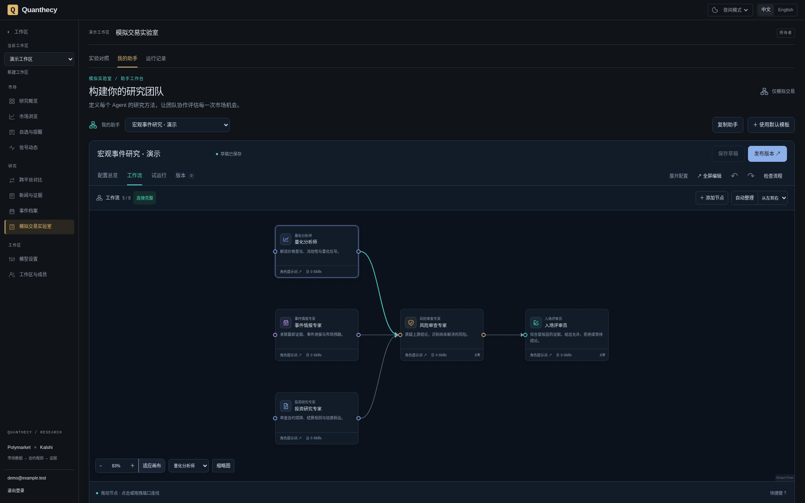
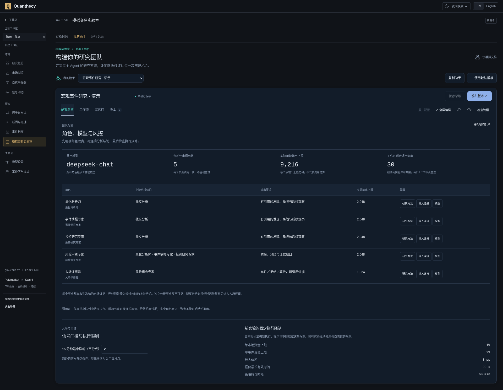
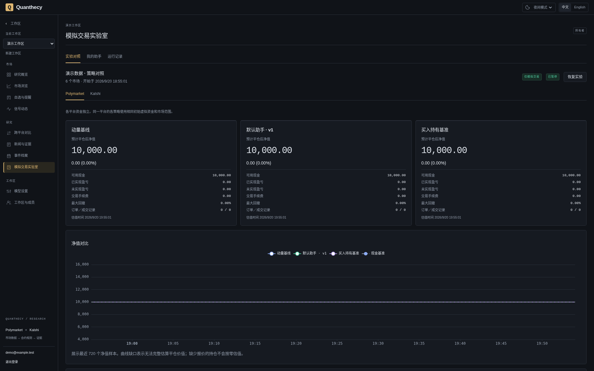
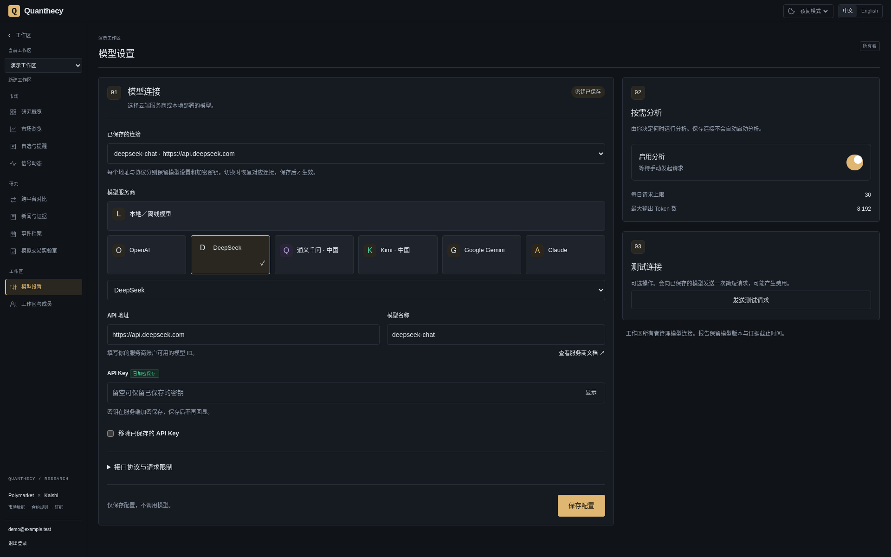

# Quanthecy

[English](README.md) · **简体中文**

**预测市场研究、多 Agent 工作流与模拟交易实验室。**

在同一工作区研究 **Polymarket** 与 **Kalshi**：从市场数据和可追溯证据出发，配置研究团队，发布助手版本，再用虚拟账户观察它们如何分析、拒绝、等待和参与模拟交易。

[快速开始](#快速开始) · [功能导览](#功能导览) · [架构](#架构) · [文档](#文档) · [参与贡献](#参与贡献)

[Apache-2.0](LICENSE) · 自行部署 · 中英文 · 深色 / 浅色 / 跟随系统



*当前界面，演示工作区。2026-09-20 截图使用独立演示数据；不代表已完成的模型分析或实验业绩。*

**持续开发中的研究平台。** 支持虚拟资金模拟，不连接钱包、不发送真实交易订单。市场覆盖经过筛选，历史从开始采集时积累；尚未验证预测准确率或策略盈利能力。

## 功能导览

### 配置一支可以检查的研究团队

通过工作流画布配置量化分析、事件情报、合约分析、风险复核和入场评审。编辑各节点的 Prompt 与 Markdown Skills，用连线明确上游依赖，检查流程后保存草稿、试运行或发布不可变版本。

- **看清分工：** 配置总览展示角色、直接上游、输出要求，以及可追加的研究方法清单。
- **看清预算：** 展示每轮调用数、工作区剩余额度和节点输出上限。节点可设置独立 token 上限，目前仍共用工作区模型。
- **看清依据：** 每个节点使用冻结市场证据，仅接收显式连接的上游结论；运行记录保留输入、校验后的输出、模型配置和用量。
- **顺手编辑：** 拖拽、缩放、全屏、自动整理、撤销与重做；节点可以拖到原点左侧，充分使用画布空间。

<details>
<summary>查看团队配置与风控总览</summary>



分析分支在输入上独立，当前工作区队列按顺序执行模型调用。入场门槛可在允许范围内调整；资金上限、报价时效等固定规则由服务端执行，Prompt 无法放宽。已有实验遵循其冻结规则。

详见[助手工作台](docs/assistant-builder.md)与[模型、角色和风控配置](docs/agent-configuration.md)。

</details>

### 在同一实验中比较助手与基准

模拟交易实验室为每个平台、每种策略建立独立虚拟账户。新对照可包含默认助手、最多三个自选发布版本、动量与买入持有账户，并展示现金基准。



*演示账户均从 10,000 虚拟本金开始，尚未成交，曲线重合；这张截图展示界面，不展示策略表现。*

同时检查净值、费用、回撤、成交记录、评审参与率、排队延迟和模型用量。专用入场评审输出 `ALLOW / REJECT / WAIT`；允许入场后仍须检查最新信号、价格、合约身份、资金与订单簿。暂停保留持仓与历史记录，继续估值和核验结算。

模拟成交使用后续订单簿快照及费用、深度和滑点约束。共享队列、拒绝、过期和样本差异都会影响结果；模型费用在没有账单数据时保持未知。详见[模拟执行规则](docs/paper-trading-v2.md)与[多助手实验](docs/assistant-builder.md#模拟交易与评估)。

### 保存模型连接，在本地与云端之间切换

模型设置支持保存多个连接档案，恢复各自的模型名、输出上限和相关选项。连接按工作区、协议和完整 API 地址隔离；切回原连接可以复用它的已保存密钥。

<details>
<summary>查看模型连接设置</summary>



密钥在服务端加密，前端只显示是否已保存；新地址不会继承其他连接的密钥。页面浏览、保存配置与发布助手不调用模型。显式测试、试运行和启用实验后的自动评审可能产生费用。

这是演示连接配置，未执行服务商调用。部署要求及本地端点配置见[模型设置指南](docs/research-terminal.md#one-time-server-setup)。

</details>

### 从市场数据追溯到研究结论

| 能力 | 可以检查什么 |
| --- | --- |
| 市场终端 | 概率历史、买卖报价、价差、采样成交量、合约规则、CSV / Parquet 导出 |
| 数据质量与信号 | 价格和成交量的独立可用性、计算版本、阈值与原始观测引用 |
| 新闻与事件证据 | 文档版本、发布时间与首次观测时间、原文段落及关联程度审核 |
| 跨平台对比 | 经审核的结果对应、结算规则与差异，避免直接把价差当作套利 |
| 自选与提醒 | 工作区共享列表、中间价变化和价差扩大提醒，保留触发输入 |
| 研究报告 | 单 Agent 或专家团队的结构化结论、引用、限制和验证诊断 |

<details>
<summary>查看市场研究终端与早期真实采集截图</summary>


这张图为 2026-09-17 的实际采集数据截图，界面早于当前版本。研究概览、信号、事件档案、新闻与运营后台的中英文原图均保留在[截图索引](docs/images/README.md)，并与本次演示截图分别说明来源。

</details>

## 快速开始

需要 **Docker Engine 与 Docker Compose 2.24.4 或更新版本**。容器启动方式不要求在宿主机安装 Python、Rust、Node.js 或数据库。首次构建需要访问镜像和软件包仓库。

克隆或下载仓库后，在项目根目录执行：

```bash
cp -n .env.example .env
docker compose up --build -d --wait
```

`migrate` 服务会先应用 Django 和 ClickHouse 迁移，再启动依赖服务。PostgreSQL、ClickHouse、Redis 及采集器持久化日志使用命名卷保存。

| 入口 | 本地地址 |
| --- | --- |
| 研究工作台、注册与登录 | [localhost:3000](http://localhost:3000) |
| API 文档 | [localhost:8000/api/v1/docs](http://localhost:8000/api/v1/docs) |
| Django 运营后台 | [localhost:8000/admin/](http://localhost:8000/admin/) |
| 后端存活 / 依赖就绪检查 | [health](http://localhost:8000/health) / [ready](http://localhost:8000/ready) |

1. 在前端注册账号，系统会创建个人工作区及 OWNER 成员关系。**项目没有默认账号或密码。**
2. 打开「市场浏览」。默认每 60 秒从每个交易所采样最多 10 个市场；价格与成交量分析需要至少 15 分钟足够连续且合格的观测。
3. 如需模型分析，先按[服务端模型设置](docs/research-terminal.md#one-time-server-setup)配置稳定的 `AGENT_ENCRYPTION_KEY` 与允许的服务商地址，再由工作区所有者在「模型设置」保存并启用连接。本地 `make setup-local` 可初始化缺失的加密密钥，需要宿主机 Python 3；纯 Docker 设置方式见同一指南。模型默认关闭。
4. 进入「模拟交易实验室 → 我的助手」，复制默认模板，编辑角色与依赖，检查配置后试运行，再发布版本。试运行会调用模型，但不创建模拟订单。
5. 在「实验对照」选择已发布版本与市场，启动虚拟资金实验。启用后，合格机会会自动排队请求模型评审，并消耗工作区额度。

首次安装需要积累数据；新闻来源、研究主题与示例档案的初始化方式见[新闻来源](docs/news-sources.md)和[采集覆盖](docs/collection-coverage.md)。README 的演示账户不会自动导入新安装。

<details>
<summary>管理员设置、采集范围、端口与开发模式</summary>

另行创建平台管理员：

```bash
docker compose exec backend python apps/backend/manage.py createsuperuser
```

管理采集范围及初始化带日期的美联储示例，参见[采集覆盖](docs/collection-coverage.md)与[事件证据设置](docs/event-evidence.md)。已审核市场对的初始化方式见[跨平台对比设置](docs/cross-market-evidence.md#initial-pair-setup)。复用示例名单前，请重新核对日期与合约有效性。

`.env` 中的 `WEB_PORT` 和 `BACKEND_PORT` 控制本地主机端口。`DJANGO_CSRF_TRUSTED_ORIGINS` 留空时会跟随 `WEB_PORT`，也可显式设置自定义来源。修改配置后重建相关容器；需要代理时参见[可选代理设置](docs/market-research.md#optional-local-proxy)。

热更新开发可运行 `make dev`，其本地初始化脚本需要宿主机 Python 3。依赖或 Rust 代码变更后需重新构建镜像。停止服务并保留命名卷：

```bash
docker compose down
```

</details>

## 架构

```text
Polymarket / Kalshi
        │
        ▼
Rust + Tokio 采集器 ─────────► ClickHouse：历史观测
        │                              │
        └────► Redis：实时状态          ▼
                              Python：确定性指标与信号
                                       │
官方与媒体资讯源                        ▼
        │                         冻结研究上下文
        ▼                              │
Python 新闻工作进程                     ▼
        │                     Agent 工作进程：专家研究
        ▼                              │
PostgreSQL：证据 ◄──────────────────────┘ 研究记录
        ▲
        │
Django + Django Ninja ── 分析数据仓储层 ── ClickHouse
        ▲
        │ 统一应用 API
React + TypeScript + Vite
```

| 层次 | 职责 |
| --- | --- |
| Rust / Tokio | 交易所采集、标准化、批量写入、持久化重放与恢复 |
| Django / Django Ninja | 身份认证、工作区、权限、类型化 API 与后台管理 |
| Python 工作进程 | 确定性分析、信号、官方证据、LangGraph Agent 工作流、模拟执行与维护 |
| PostgreSQL | 事务性应用数据、市场元数据、证据、助手版本、运行记录与虚拟账本 |
| ClickHouse | 历史分析观测与可复现的信号数据 |
| Redis | 可丢弃的实时状态、缓存与协调信息 |
| React / TypeScript / Vite | 用户研究界面、图表、语言与主题偏好 |

Django 是统一的公共应用后端，通过 ORM 迁移管理 PostgreSQL 模式；ClickHouse 使用独立分析数据仓储层。长任务由独立工作进程执行，前端通过 Django API 获取数据。

模拟实验中，合格信号触发冻结工作流评审；`ALLOW` 结果仍需经过确定性执行检查，再由后续订单簿快照决定模拟成交。Django 保留工作流版本、评审、订单与虚拟账本，支持逐项核查。

**身份与权限：** `User = 身份`、`Organization = 工作区`、`Membership = 授权`。用户与工作区采用 UUID，邮箱唯一性不区分大小写。OWNER、ADMIN、MEMBER、VIEWER 属于工作区角色，与平台管理员权限分开；服务端执行租户隔离。外部身份关联已有模型边界，第三方登录尚未实现。

**数据语义：** 标准化观测保留平台与交易所标识、市场和结果身份、规则版本、接收时间、明确的概率口径与来源、买卖报价、成交量单位与口径，以及质量标记。原始交易所 JSON 单独保留。中间价、最新成交价和实际可成交价格不能混为一谈。

**信号框架：** 当前确定性信号包括 `PROBABILITY_SPIKE`、`PROBABILITY_DROP`、`VOLUME_SPIKE` 和 `SPREAD_WIDENING`。信号记录计算版本、参数与来源观测 ID，支持重放复现。LLM 负责解读这些计算结果，不承担数值计算引擎的职责。

### 结构化研究输出示例

以下为单 Agent 快速研究的示意 JSON，引用 ID 是占位符，不代表已发布的真实结果。`confidence` 表示对研究优先级判断的信心，不是事件概率。

```json
{
  "action": "WATCH",
  "confidence": 0.6,
  "thesis": {
    "kind": "HYPOTHESIS",
    "text": "在相关证据完成审核前，继续观察该合约。",
    "references": ["evidence:example"]
  },
  "claims": [],
  "counter_evidence": [],
  "key_signals": [],
  "risk_flags": ["尚未确定证据与事件之间的直接关联。"],
  "follow_up": ["审核来源版本，并核对合约结算规则。"]
}
```

## 当前范围与后续方向

| 已实现 | 后续方向，尚未实现 |
| --- | --- |
| 工作流画布、Prompt / Skills、冻结发布版本、逐节点运行记录 | 版本差异、更多研究团队模板 |
| 已保存的本地 / 云端连接、节点 token 上限、工作区额度 | 节点独立选模、版本化可配置风险策略 |
| 前瞻模拟实验、多助手账户、基准对照、可复算成交记录 | 共同输入的配对评估、角色贡献归因、预测校准 |
| 选定市场 REST 采集、质量检查、可重放信号、历史导出 | 更广覆盖、流式成交和订单簿、完整历史回测 |
| 文档证据、事件档案、审核后的跨平台对比、自选与站内提醒 | 更多来源、外部提醒、团队邀请、外部登录与订阅计费 |

采集快照不能替代完整逐笔历史或保证可成交的流动性。当前以宏观与利率作为首个策划研究主题；详细后续设计见[Agent 配置路线](docs/agent-configuration.md)。

## 生产部署

[compose.prod.yaml](compose.prod.yaml) 提供单服务器部署配置。请按[生产配置指南](docs/foundation.md#production-configuration)设置域名、独立密钥与 HTTPS，并保持数据库仅内部可达。在公开上线前，还需完成备份恢复、监控、认证限流与账号恢复等运营工作。

## 文档

技术文档包含中英文；助手配置与实验指南优先说明当前实现和使用边界。

| 指南 | 内容 |
| --- | --- |
| [研究终端](docs/research-terminal.md) | 图表交互、模型连接、配额和任务 |
| [专家研究团队](docs/intelligence-team.md) | 角色、上下文范围、报告与校验 |
| [自选与提醒](docs/watchlists-alerts.md) | 工作区自选、规则窗口、触发依据和服务恢复 |
| [模拟交易实验室](docs/paper-trading-v2.md) | 虚拟账户、自动入场评审、版本化对照与成交复算 |
| [可编排助手](docs/assistant-builder.md) | LangGraph 拖拽团队、版本发布、单次试运行与多助手模拟对照 |
| [数据质量](docs/data-quality.md) | 准入规则和指标限制 |
| [市场发现](docs/market-directory.md) | 分页目录、批量纳入、分层采集及结算复查 |
| [采集控制](docs/collection-controls.md) | 后台开关、各来源频率、生效确认与恢复 |
| [采集覆盖](docs/collection-coverage.md) | 研究主题、合约名单和采集器确认 |
| [事件档案](docs/event-evidence.md) | 事件定义、精确来源版本和关联审核 |
| [新闻来源](docs/news-sources.md) | 来源名单、采集控制、溯源及健康状态 |
| [官方文档](docs/official-evidence.md) | 来源采集、段落溯源和限制 |
| [市场研究](docs/market-research.md) | 历史、信号、导出与复现 |
| [对比与证据](docs/cross-market-evidence.md) | 规则对齐、官方资讯与历史截止时间 |
| [平台管理](docs/platform-administration.md) | 运营角色、用户、原始数据、清理和审计 |
| [基础架构](docs/foundation.md) | 身份、API、开发与部署 |
| [产品范围](docs/product-scope.md)、[路线图](docs/roadmap.md)、[自动化研究](docs/automated-research.md) | 产品方向和后续规划 |
| [AGENTS.md](AGENTS.md) | 架构和贡献规范 |

核心开发入口：[Agent 配置与边界](docs/agent-configuration.md) · [金融终端视觉](docs/frontend-terminal.md) · [隔离测试与 CI](docs/testing.md) · [截图来源](docs/images/README.md)。

## 参与贡献

欢迎改进采集可靠性、数据质量、研究评估、助手体验与文档。先阅读 [AGENTS.md](AGENTS.md) 和[贡献指南](CONTRIBUTING.md)，也可以[报告问题](https://github.com/chongliujia/Quanthecy/issues/new?template=bug_report.yml)或[提出功能建议](https://github.com/chongliujia/Quanthecy/issues/new?template=feature_request.yml)。支持中英文交流。

```bash
make check       # 隔离测试栈：Python、Rust、前端与契约检查
make test-down   # 清理测试栈
```

测试使用独立的 PostgreSQL、ClickHouse 和 Redis，模拟交易所与模型响应，不需要服务商密钥。也可分别运行 `make test-python`、`make check-python`、`make test-rust`、`make test-web` 和 `make check-contracts`，详见[测试说明](docs/testing.md)。请勿提交凭据、本地数据库或私人账号截图。

## 许可证

项目代码使用 [Apache License 2.0](LICENSE)。交易所数据、官方文档及其他第三方内容仍受各自条款约束，代码许可证不会重新授权这些来源内容。
