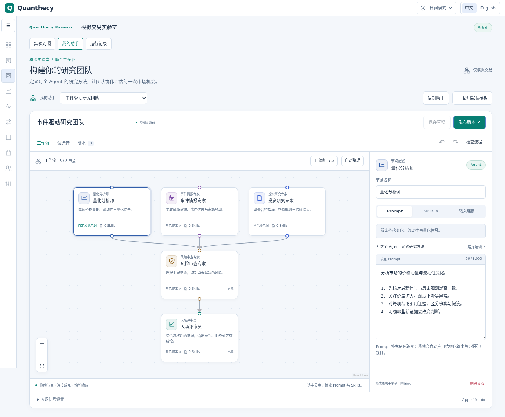
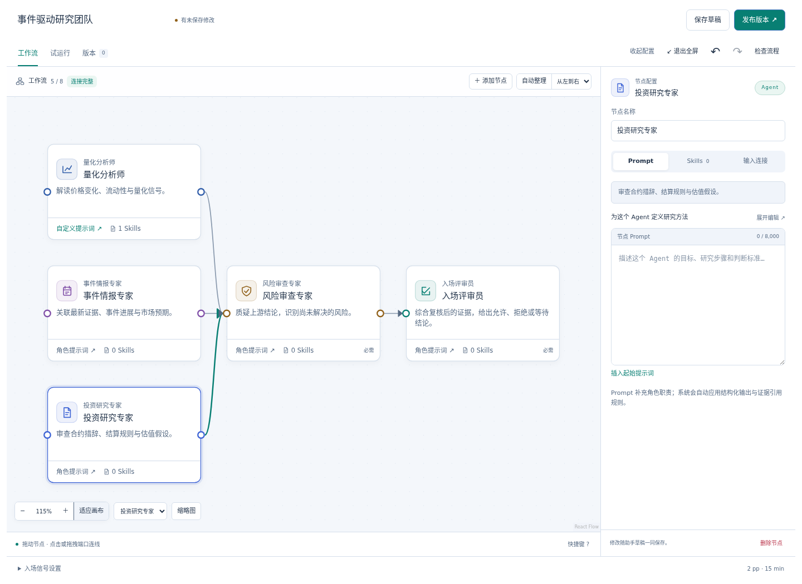
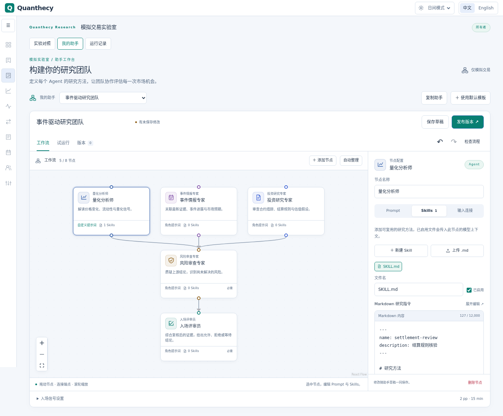

# 可编排助手与模拟对照 — paper-v3

模拟交易实验室新增「我的助手」「实验对照」「运行记录」。用户可以复制默认团队，拖拽修改分析节点及依赖，保存草稿、发布版本，单次试运行，再将发布版本加入使用虚拟本金的前瞻实验。

角色配置总览、节点输出预算与风控说明见 [专业化 Agent 配置](agent-configuration.md)。

## 使用流程

1. 在「我的助手」选择「使用默认模板」。默认包含量化、事件情报、合约分析、风险复核和入场评审五个角色。
2. 在工作流画布拖动节点，拖拽端点或依次点击输出、输入端口连线。连线时高亮可用目标，错误连接显示原因；未接入流程的节点会标记提醒，可点击提醒定位。节点「输入连接」页提供同等的复选框操作。
3. 点击节点底部的 Prompt 或 Skills 直接打开对应编辑区；在「Prompt」编写指令，在「Skills」新建、上传或编辑 Markdown 文件，支持单独启用、停用和下载。编辑器可展开到弹窗。工作流下方可调整最小 15 分钟涨幅（2–20 个百分点）。
4. 「检查流程」验证依赖；「保存草稿」保存编辑；「发布版本」会先保存当前修改，再生成不可变版本。保存失败时不会继续发布。未完成的流程可以存为草稿，发布和运行必须通过完整校验。
5. 在「试运行」选择市场并启动，可先自动保存当前修改。检查节点输入、引用、结构化结论、耗时及用量。试运行不创建任何模拟订单。
6. 将发布版本加入对照。新实验包含默认助手、最多三个自选版本、动量和买入持有账户，以及现金基准。每个平台、每个账户的本金独立。

保存、发布、复制和打开页面不会调用模型。单次试运行是显式调用；开启实验后，合格机会才自动排队评审。每个节点使用工作区当前启用的模型，不会自动启用模型或改写凭据。

## 画布操作

- 「全屏编辑」扩大工作区，「收起配置」把空间留给画布；从节点卡片打开 Prompt 或 Skills 会自动展开配置栏。
- 支持横向、纵向自动整理、缩放百分比、恢复 100%、适应画布、节点定位及可拖动缩略图。适应画布为底部控件预留空间。
- 调整窗口或收起配置栏时保留缩放与视野中心；切换试运行、版本后回到工作流，保留视角和草稿。
- 新节点添加在当前视野附近，自动避开已有节点并定位到新节点。最多八个节点。
- 点击连线显示删除按钮；画布获得焦点时，Delete 删除选中的节点或连线，Ctrl/⌘+Z 撤销，Ctrl/⌘+Shift+Z 重做，F 适应画布，Esc 取消连线或关闭菜单，Space+拖动平移。风险复核和入场评审节点不可删除。文本编辑器保留原有键盘行为。
- 节点按钮支持方向键微调；端口支持 Enter/空格连线。画布内「快捷键」可随时查看说明。

## 节点 Prompt 与 Skills

Prompt 最多 8,000 字符；每个节点最多 5 个 Markdown 文件，每个最多 12,000 字符、16,000 字节。Prompt、旧研究关注点和全部文件的序列化内容合计最多 32,000 字节。上传要求 UTF-8 和 `.md` 文件名，不接受目录路径、重复文件名、二进制控制字符或脚本文件。上传与在线编辑均在客户端和 API 校验；文件内容存入组织内的图 JSON，无独立公共文件 URL，不需要数据库结构迁移。

每个节点的 `assistant_prompt` 和启用的 `assistant_skills` 实际传入该 LangGraph 节点的模型输入，并记录在步骤输入快照中。文件可以包含 YAML frontmatter，但整体作为 Markdown 研究指令处理，不注册可执行工具，不执行脚本或加载外部链接。禁用文件保留在草稿/版本快照中，不发送给模型。用户指令不能覆盖角色、结构化输出、证据引用或平台风控规则。

发布和排队时冻结 Prompt、文件名称、正文与启用状态，后续修改不改变历史版本或正在运行的任务。没有新增自定义内容的旧图保持原有序列化格式与哈希。单节点完整输入包上限为 112,000 字节，其中新增定制内容预算为 32,000 字节，超过上限会停止模型调用。

前端画布使用 [React Flow](https://reactflow.dev/learn/customization/custom-nodes)，后端编排继续由 LangGraph 执行。画布宽度变化时自动适配；桌面节点编辑区独立滚动，手机纵向排列。切换实验室分区保留未保存的草稿，切换助手前提示未保存修改，刷新/关闭页面时使用浏览器离开提示。旧研究关注点可直接在 Prompt 编辑器继续编辑。

## LangGraph 执行

`quanthecy_analytics.assistant.build_workflow` 将用户发布的节点与连线编译为真实的 LangGraph `StateGraph`，由 LangGraph 执行依赖关系，不另建手写任务遍历器。

- 类型化状态包含冻结的市场上下文、按节点 ID 保存的分析结果和最终入场评审。
- reducer 合并不同节点结果并拒绝重复节点写入。
- 多来源连线通过 `add_edge([parents], target)` 实现汇总屏障，包括长度不等的分支；下游等待全部直接上游完成。
- 模型仅收到显式连接的上游结论。相互独立的分析节点不会看到彼此的输出。
- 图最多八个模型节点，必须包含一个风险复核和一个终端入场评审。所有分析路径必须经过风险复核；拒绝循环、孤立节点、重复 ID、缺失目标和风险绕过。
- `max_concurrency=1` 限制同一工作区的请求突发；分支在输入证据上保持独立。工作区继续只允许一个活动 Agent 任务。
- 节点调用既有 provider adapter，继续使用超时、独立模型子进程、租约、额度、角色复核、结构化输出和引用校验。LangGraph 不创建公开后端或独立服务。

LangGraph 的状态编排与现有 Django 持久化协同：图快照、哈希、运行状态、每步完整输入包、验证后的输出和用量保存在 `AgentRun`。本版不提供跨进程 checkpoint 恢复、自动重试、跨运行长期记忆或任意代码节点。worker 中断后按现有租约机制终止任务，已经完成的节点记录保留；重新试运行是一次新的显式请求，避免在不确定请求是否已计费时自动重复调用。

参考：[LangGraph Graph API](https://docs.langchain.com/oss/python/langgraph/graph-api)、[多父节点汇总](https://reference.langchain.com/python/langgraph/graph/state/StateGraph/add_edge)。

## 版本与组织边界

- `Assistant` 属于工作区，持有可编辑草稿和乐观锁修订号；旧修订保存、发布或运行会被拒绝。
- `AssistantVersion` 保存名称、图、哈希、运行协议版本和发布人。API 无覆盖或删除发布版本的入口；重复发布未改变的草稿返回同一版本。
- 试运行冻结已保存草稿；模拟账户通过受保护外键绑定发布版本；后续草稿改动不改变这些快照。
- OWNER、ADMIN、MEMBER 可编辑和运行，VIEWER 只读。所有助手、版本、运行、模拟账户查询都由服务端验证组织归属，写接口保留会话认证与 CSRF。
- 每工作区最多 30 个助手，每助手最多 100 个发布版本；选择界面展示最近 20 个版本。运行列表返回最近 30 条摘要，完整节点输入仅在详情接口读取。

## 模拟交易与评估

paper-v1/v2 保留原语义。paper-v3 允许同一工作区保存多个历史对照批次，但同一时刻仍最多运行一个实验。已有实验时，新对照复用其市场范围；启动时停止旧实验新交易，取消待执行订单和评审，保留账本、持仓、估值和结算。

每个助手账户拥有独立候选及唯一评审任务。研究报告的 `WATCH / INVESTIGATE` 不转换为入场动作；最终节点使用专门的 `ALLOW / REJECT / WAIT` 合约。允许入场仍需重新验证最新信号、版本、模型配置、合约身份、价格、资金与事件敞口，并通过既有后续订单簿和成交延迟机制。

每次评审按整个图的节点数预留工作区调用额度，失败或取消不退回预留。实验每日评审次数与工作区每日模型调用次数是两个独立上限：五节点团队的一次评审占五次调用。共享队列可能使其他助手错过机会，结果中的排队、失效、参与率和调用量用于解释这类差异。

各助手账户展示净值、已实现和未实现盈亏、手续费、回撤、共同基线机会参与率、信号到报告耗时及输入/输出 token。共同机会按同一实验、市场和观测标识匹配实际动量成交；它不是胜率。模型费用没有账单数据时保持不可用，不按零费用处理，也不扣减虚拟本金。新旧实验开始时间不同，不作为同期收益对照。

## 部署与验证

应用新增 agents 和 paper Django migrations，更新 backend、agent-worker、paper-worker 和 web。数据库迁移保留历史记录；不可回退迁移以删除实验。部署前应备份 PostgreSQL，并在更新时暂停旧版两个 worker，防止旧代码消费新助手任务。

测试覆盖 LangGraph 不等深分支汇总与单次执行、非法图拒绝、证据依赖隔离、发布冻结、草稿冲突、组织隔离、VIEWER、CSRF、调用额度、暂停、节点失败、无订单试运行、端到端模拟成交和账本复算。模型响应使用夹具，不需要真实模型费用。

### 本地核验记录（2026-09-18）

- 全量 Python 回归：424 通过，5 项需显式启用的 ClickHouse 集成测试跳过。随后最终助手边界复测 19 项通过，历史评估兼容性复测 18 项通过。
- 前端 95 项测试、TypeScript、ESLint、生产构建通过；Python Ruff、修改文件格式、mypy 与迁移一致性检查通过。
- backend/web Docker 生产镜像构建成功。数据库已备份；迁移前后的 2 个实验、12 个账户、61 条账本、58 笔订单、44 条持仓及模型配置摘要一致。
- 本地部署 API 的模板、创建、保存、图校验、发布、助手列表、运行列表和现有实验查询均返回 200。写入验证在数据库事务中回滚，未遗留测试助手，未发送模型请求。
- 当前会话无可用浏览器连接，未进行浏览器截图检查；页面交互通过组件测试验证。

### UI 与 Skills 更新核验（2026-09-18）

- 助手图与后端集成测试 33 项通过，覆盖旧图哈希、文件边界、节点隔离、启用状态、API 保存、发布/排队冻结，以及真实 LangGraph 执行适配器收到 Prompt 与 Skills。模型响应均使用夹具。
- 前端 97 项测试通过，TypeScript、ESLint、生产构建通过；Python Ruff、181 个模块的 mypy 检查通过。
- 本机 Chrome 使用隔离 API 夹具进行了桌面深浅色和 390px 手机视口核验，实际操作上传、弹窗编辑、自动保存发布、节点拖拽、撤销和连接编辑；不写入用户实验，也不发送付费模型请求。
- 已更新本地 backend、web、agent-worker、paper-worker。11 个服务健康；生产前端浏览器交互检查通过。部署后模板、创建、保存、校验、发布、列表、运行列表与既有实验查询均返回 200；验证事务全部回滚，无遗留测试助手、无模型请求。网页、CSRF 和 ready 探测返回 200。
- 宽屏补查：移除模拟实验室外层的 1,500px 宽度上限，改为填满工作区。部署后在 390、768、1280、1440、1920、2560、3440px 以及展开导航的 2560px Chrome 视口中，编辑器均与可用内容宽度一致，无横向溢出；2560px 收起导航时右侧空白由 976px 降为正常的 36px 页面边距。

### 画布交互优化核验（2026-09-18）

- 前端 102 项测试通过，TypeScript、ESLint 与 Docker 生产构建通过。新增覆盖布局保留配置、节点避让、断开路径提示、重复/循环/风险绕过拒绝、键盘连线、编辑面板收起与直接打开、删除撤销及文本编辑保护。
- Chrome 在开发服务和更新后的本地生产前端完成点击/拖拽连线、错误目标提示、横向整理与撤销、连线删除恢复、节点添加定位和删除、缩略图、试运行页切换后的视角恢复、全屏进出与 Prompt/Skills 保留检查，无页面错误。
- 在 390、768、1280、1920、2560、3440px 视口验证无横向溢出，并检查桌面深浅色与全屏截图。适应画布为底部导航预留空间。
- 本次只更新 web 容器。网页、CSRF 均返回 200，11 个服务健康。浏览器采用隔离 API 夹具，没有写入用户助手或实验，没有模型请求。
